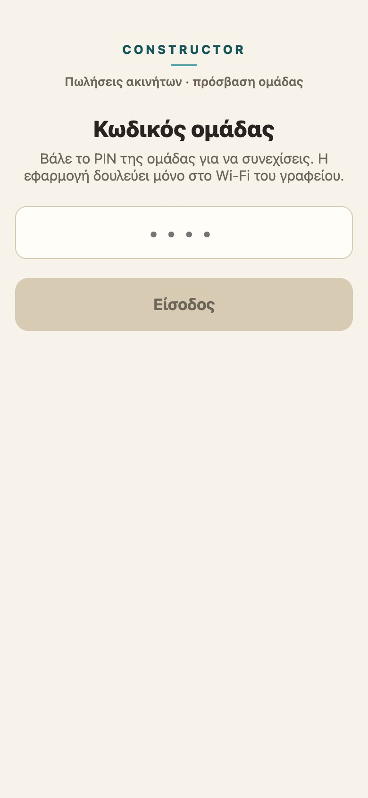
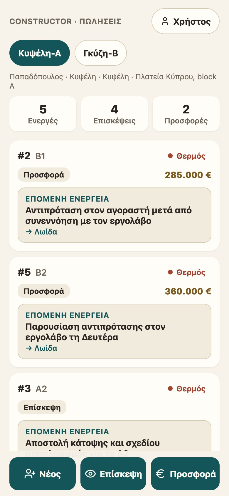
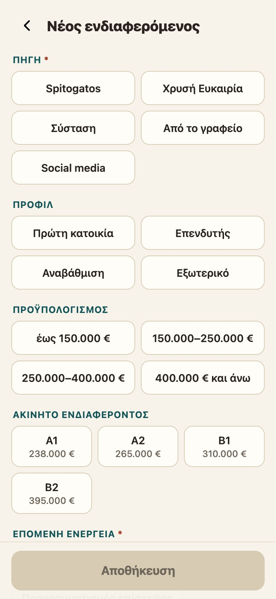
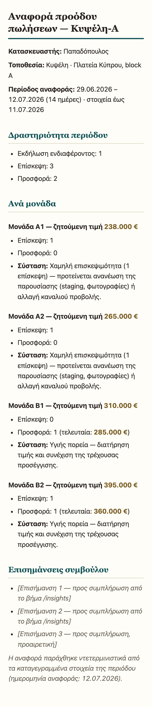
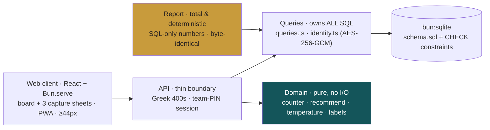

<div align="center">

# Constructor

**The outsourced sales department, as software.**

A mobile-first sales-operations tool for a real-estate agency that runs the sales function for
construction firms: capture every lead, viewing and offer in under 30 seconds one-handed, watch a
needs-attention-first pipeline board, and generate a deterministic, forward-to-the-builder progress
report with one command.

[](https://bun.sh)
[](https://www.typescriptlang.org/)
[](#quality--governance)
[](#the-impact-loop--design-quality-as-a-rail)
[](#the-invariants-that-matter-most)

</div>

<table>
  <tr>
    <td width="25%"></td>
    <td width="25%"></td>
    <td width="25%"></td>
    <td width="25%"></td>
  </tr>
  <tr>
    <td align="center"><sub>Team-PIN gate</sub></td>
    <td align="center"><sub>Needs-attention-first board</sub></td>
    <td align="center"><sub>≤30s one-handed capture</sub></td>
    <td align="center"><sub>Deterministic builder report</sub></td>
  </tr>
</table>

> The interface is Greek (its operators are a three-person Athens office); the codebase, docs and
> commit history are English. Visual direction: **«Πεύκο & Μέλι»** — Aegean-pine, a single honey
> accent for money, warm alabaster grounds.

---

## Why this repo is worth a read

Constructor is a small product built like a large one. It is governed by a **written constitution**,
every line of production code is **test-first by an enforced rule**, and the machine will physically
**refuse a commit** that violates an invariant. It exists to show that a prototype can be disciplined
without being slow.

- **A constitution, not conventions.** Ten binding [Articles](.specify/memory/constitution.md) govern
  the code, enforced by a stack of gates — not by good intentions.
- **Determinism as a product feature.** The builder report makes no LLM call, reads no wall-clock, and
  applies no locale formatting: the same database and flags always produce **byte-identical** output.
  A report is reproducible evidence, not a rendering.
- **Privacy by construction.** Personally-identifying data lives *only* in an AES-256-GCM-encrypted
  table, behind a fail-secure key. Analytics, reports, queries and logs are structurally unable to
  touch it.
- **A design-quality control loop.** Design isn't reviewed by taste — it's **measured** by an honest
  benchmark that binds a blind AI judge panel to objective facts, then improved one highest-leverage
  lever at a time. See [the IMPACT-LOOP](#the-impact-loop--design-quality-as-a-rail).
- **437 tests, mutation-verified.** Rule-pinning tests are proven to fail when the rule is broken — a
  green suite that actually guards something.

---

## Architecture

Dependencies point **inward**. The domain is pure (no I/O); the query layer owns all SQL; the API is a
thin validating boundary; the web client is a thin renderer. Nothing downstream can reach around a
layer to break an invariant.



**Data flow of a capture:** the web sheet posts once → the API validates and throws a Greek 400 on bad
input → the query layer writes inside one transaction behind the schema's `CHECK` constraints → the
board re-reads server-ordered, needs-attention-first. Errors are loud at the boundary; the report path
is *total* and never throws.

---

## The IMPACT-LOOP — design quality as a rail

Most projects review design by opinion. Constructor **measures** it, and the measurement is built so it
**cannot flatter the work**.

- **An un-driftable score.** Each rubric dimension is `α · O + (1 − α) · min(S, cap)` — a blind
  3-judge panel `S` **capped by objective, machine-measured fact** `O`. A screen that is 0 % on-palette
  *cannot* be scored "warm 8". Every round reports the objective-vs-subjective split, so drift is visible.
- **Anti-drift panel.** Judges score a researched reference ladder (2 / 5 / 8 / 10) and pass a
  calibration gate; a miscalibrated judge is discarded. Decks are neutral-named and per-judge shuffled.
- **Impact-first.** `ExpectedLift = Σ weight · min(headroom, gain)` ranks a catalog of candidate
  improvements; the loop implements the single highest-leverage one per round, under all rails, then
  **verifies the predicted lift actually landed**.
- **Tiers with hard gates.** T0 Functional → T1 Coherent → T2 Branded → T3 Reference-grade, each gated
  on an objective check, so a tier can't be faked either.

The loop runs as a deterministic [dynamic workflow](.claude/workflows/impact-loop.js) (measure → rank →
research → propose) and has taken the app from a generic baseline (**5.63**) to **T2 "Branded"
(7.78 / 10)** across two elevation rounds. Method: [`IMPACT-LOOP.md`](IMPACT-LOOP.md).

---

## Tech stack

| Layer | Choice | Why |
|---|---|---|
| Runtime | **Bun** (`bun test`, `bun:sqlite`, `Bun.serve`) | one toolchain — test runner, SQLite driver, bundler, server |
| Language | **TypeScript**, strict | invariants expressed in the type system |
| Web | **React 19** + `lucide-react`, inline design tokens | installable PWA; **zero** runtime deps beyond {react, react-dom, lucide-react} |
| Storage | **SQLite** with `CHECK` constraints | the schema is the last line of defence for an invariant |
| Crypto | **AES-256-GCM** (`node:crypto`) | PII encryption, key from env only, fail-secure |

---

## Quickstart

```bash
bun install
bun run db:init                       # idempotent — create/upgrade the SQLite schema
bun run seed seed.example.json        # load a synthetic pipeline (pseudonyms only, no PII)
bun test                              # the full suite (437 tests)
bun run dev                           # API + web client at http://localhost:3000

# one-command builder report (deterministic Greek HTML):
bun run report --builder="Παπαδόπουλος" --project="Κυψέλη-Α" --period=biweekly --html > report.html
```

Running exposed on the office LAN requires a team PIN (fail-secure — it refuses to start on a
non-loopback host without one). See [`CHECKLIST-B0.md`](CHECKLIST-B0.md) for the field-trial runbook.

---

## Quality & governance

Correctness here is **mechanical**, layered so that no single lapse ships:

| Layer | What it enforces |
|---|---|
| **Constitution** ([10 Articles](.specify/memory/constitution.md)) | the non-negotiable principles the code may never drift from |
| **TDD Iron Law** (Article IX) | no production code without a failing test first — watched fail, then made green |
| **`scripts/verify-gates.sh`** | executable constitution gates; runs on every commit via a git hook |
| **Git hooks** | block commits that fail the gates or the message discipline |
| **Claude hooks** (`.claude/hooks/`) | block `git add -A`, `--no-verify`, direct-to-master, in-app LLM tokens, fail-open secrets |
| **Schema `CHECK`s** | the database rejects an invalid row even if every layer above it failed |
| **ZONING** ([`.claude/ZONING.md`](.claude/ZONING.md)) | a literal decision tree classifying every change green / yellow / red |

Rule-pinning tests are **mutation-verified**: the guarded rule is broken on purpose to confirm a test
fails, then restored — so the suite proves it actually guards something, not merely that the code is
currently correct.

### The invariants that matter most

- **Article II — no opportunity without a next action.** A JS guard, a strengthened SQL `CHECK`, and a
  submit-disable in the UI, in depth.
- **Article III — deterministic core, thin AI edges.** No LLM call anywhere in the app; report numbers
  come from SQL only; byte-identical across machines and days.
- **Article IV — privacy by construction.** PII lives only in `buyer_identity` via
  [`identity.ts`](src/db/identity.ts) (AES-256-GCM, key from `CONSTRUCTOR_PII_KEY`, fail-secure);
  erasure needs no key; analytics/reports/queries/logs never touch it.
- **Article VI — the report is the product.** No zero or cold metric is ever emitted without an
  adjacent, data-derived recommendation.

---

## Project structure

```
src/
  domain/      pure business logic — counter, recommend, temperature, labels, pin (no I/O)
  db/          queries.ts (owns all SQL) · identity.ts (encrypted PII) · schema.sql · seed.ts
  api/         server.ts — thin Bun.serve boundary, Greek validation errors, team-PIN gate
  report/      biweekly · monthly · brief · html · separation — deterministic, total over data
  web/         App.tsx (board + capture sheets) · «Πεύκο & Μέλι» design tokens · PWA manifest
tests/         437 tests — one per requirement, named for the Article/FR it pins
scripts/       verify-gates.sh · git-hooks/ · design/ (the IMPACT-LOOP tooling)
.specify/      constitution + the spec-kit source of truth
docs/          codebase knowledge, screenshots, the design-loop spec & plan
```

### Documentation map

| Doc | What it is |
|---|---|
| [`.specify/memory/constitution.md`](.specify/memory/constitution.md) | the 10 binding Articles |
| [`DECISIONS.md`](DECISIONS.md) | every architectural decision record + human rulings |
| [`IMPACT-LOOP.md`](IMPACT-LOOP.md) | the design-quality loop (benchmark, tiers, engine) |
| [`docs/CODEBASE-KNOWLEDGE.md`](docs/CODEBASE-KNOWLEDGE.md) | file map, conventions, and deliberate traps |
| [`VERIFICATION.md`](VERIFICATION.md) | success-criteria verification evidence |
| [`HANDOFF.md`](HANDOFF.md) · [`CLAUDE.md`](CLAUDE.md) | the operating manual for AI-assisted work in this repo |

---

## Status

Phase-A prototype: the loop runs end-to-end (capture → board → one-command Greek report), success
criteria verified, and the design system is at tier **T2 (Branded)**. Reservations/contracts, hosting,
auth beyond the team PIN, and multi-tenant are deliberately deferred (Phase B).

<div align="center"><sub>Built with a constitution, tested first, and measured — not guessed.</sub></div>
